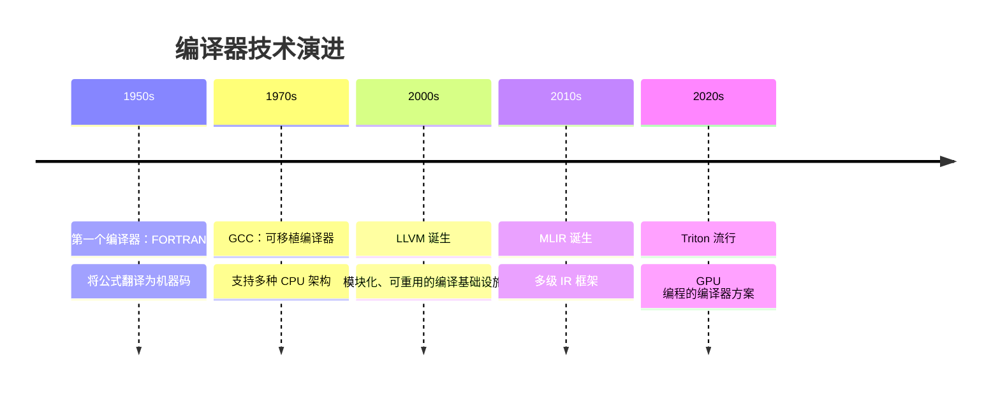
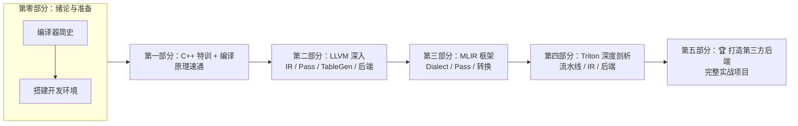

# 第 0 章：前言与导读

> **本章目标**：了解编译器的发展脉络，理解 LLVM 和 Triton 在其中的定位，建立学习动机。
>
> 📂 **第零部分：绪论与准备** — 了解编译器生态，搭建驯龙装备

> 驯龙手记：本章是整本书的"龙之全景图"——你将看到编译器世界中都有哪些龙
> （LLVM、MLIR、Triton），它们各自有什么样的力量，以及你将如何一步步驯服它们。

---

## 配套示例

本章可运行代码位于 `books/examples/chapter00/`：

| 文件 | 章节 | 说明 |
|------|------|------|
| `cuda_add.cu` | 0.5 | CUDA 线程级 vector add |
| `triton_add.py` | 0.5 | Triton 块级 vector add（需 GPU） |

运行：

```bash
cd books/examples/chapter00
./run_examples.sh
```

一键验证全书示例：

```bash
cd books/examples && ./run_all.sh
```

> 导读章节；Triton 示例在无 GPU 或无 triton 时自动跳过。

---
## 0.1 为什么是"驯龙高手"？

> 龙，是编译器。力大无穷（性能）、吐息如焰（GPU 算力）、桀骜难驯（复杂难学）。
> Triton 是海神（Triton 在希腊神话中的寓意），他能驯服海中的巨兽。
> 而你，就是那位驯龙者。

这本书的名字来自一个比喻：

```
● LLVM 是一头巨龙
  它身躯庞大（百万行 C++）、力量惊人（生成最优代码）、但脾气暴躁（错误信息晦涩）。
  驯服它的关键不是蛮力，而是理解它的脾性——IR 是它的骨骼，Pass 是它的血脉，
  TableGen 是它的语言。

● Triton 是一匹海马（或者说是海中的神兽）
  它能在 GPU 的水域（CUDA / ROCm / 自定义硬件）中自由穿行。
  驯龙者最终要学会骑乘 Triton，让它带你在不同的 GPU 之间遨游。

● 第三方后端是未知的海域
  那里的龙还没有被驯服。本书的前 24 章教你驾驭已知的龙，
  第 20-24 章则教你如何面对一条全新的龙。
```

这个比喻贯穿全书——当你在 LLVM IR 中感到迷茫时，想想龙骨的形状；当你在 Triton 的编码（Encoding）面前困惑时，想想 Triton 如何驾驭数据布局；当你面对一个新的 GPU 后端时，你就是一个驯龙者。

---

## 0.2 为什么需要学编译器？

想象你是一支 GPU 算子库团队的成员，负责在国产 GPU 上运行 AI 模型。你面临一个典型困境：

```
场景：需要在燧原 GCU（或某国产 GPU）上运行 Flash Attention

方案 A：手写 CUDA 风格的 Kernel
  → 需要学习该 GPU 的专有指令集
  → 每个新算子都要重写性能优化
  → 团队人力不足

方案 B：使用 Triton 编译器
  → 用 Python 写块级算法描述
  → 编译器自动处理线程映射、内存合并
  → 只需适配一个编译器后端
```

这就是 Triton 的价值——**写一次算法，编译到任意 GPU**。

## 0.3 编译器发展简史



### 关键里程碑

| 时间 | 事件 | 意义 |
|------|------|------|
| 1952 | A-0 系统 | 第一个"编译器"概念 |
| 1957 | FORTRAN | 第一个实用的编译器 |
| 1987 | GCC 1.0 | 开源、多目标编译器 |
| 2000 | LLVM 诞生 | Chris Lattner 的硕士论文 |
| 2005 | Apple 采用 LLVM | 成为主流编译基础设施 |
| 2019 | MLIR 开源 | 解决多级 IR 表示问题 |
| 2021 | OpenAI 开源 Triton | GPU 编程的新范式 |

## 0.4 什么是 LLVM

**LLVM (Low Level Virtual Machine)** 不是一台虚拟机，而是一个**模块化的编译器基础设施框架**。

### 传统编译器的痛点

```
传统编译器（如 GCC）：

  C 前端        C++ 前端      Fortran 前端
     │             │              │
     ▼             ▼              ▼

  GCC 中间表示 (GIMPLE) + 优化器

  GCC 后端 (RTL): x86/ARM/MIPS/...
```

问题：每个前端和后端都紧耦合，新增语言或目标架构的成本极高。

### LLVM 的三段式架构

```
  Clang(C)     Rustc        Triton  ← 任意前端
      │          │             │
      └──────────┼─────────────┘
                 ▼

        LLVM IR （统一中间表示 + 优化器）

                 │
       ┌─────────┼─────────┐
       ▼         ▼         ▼
    x86 后端  NVPTX后端  AMDGPU  ← 任意后端
```

**🔑 关键创新**：前端和后端通过 **LLVM IR** 解耦。只需实现一个前端（把源语言翻译成 LLVM IR），就能免费获得所有后端的支持。

## 0.5 什么是 MLIR

**MLIR (Multi-Level Intermediate Representation)** 是 LLVM 之上的**多级中间表示框架**。

### MLIR 解决的痛点

传统 LLVM 只有**一层** IR。对于像 Triton 这样的高级语言，从 AST 直接降到 LLVM IR 跨度太大，优化困难：

```
Python AST → ??? → LLVM IR
               ↑
          跨度很大，优化困难
```

MLIR 允许你定义**任意多层** IR，逐层降级：

```
Python AST  -->  Triton IR (tt)      -->  TritonGPU IR (ttg)  -->  LLVM IR  -->  机器码
                (设备无关块级操作)       (GPU 数据布局)            (标准 LLVM IR)
```

每一层都是正规的 MLIR Dialect——包含自己的操作、类型和属性。

## 0.6 什么是 Triton

Triton 是一个 **GPU 编程语言和编译器**，由 OpenAI 开发。

### Triton 的核心思想

```cuda
// 传统 CUDA 编程：手动管理线程
__global__ void add(float *x, float *y, float *out, int n) {
    int idx = blockIdx.x * blockDim.x + threadIdx.x;
    if (idx < n) out[idx] = x[idx] + y[idx];
}
```

```python
# Triton 编程：块级描述
@triton.jit
def add_kernel(x_ptr, y_ptr, out_ptr, n, BLOCK: tl.constexpr):
    pid = tl.program_id(axis=0)
    offsets = pid * BLOCK + tl.arange(0, BLOCK)
    mask = offsets < n
    x = tl.load(x_ptr + offsets, mask=mask)
    y = tl.load(y_ptr + offsets, mask=mask)
    tl.store(out_ptr + offsets, x + y, mask=mask)
```

**区别**：Triton 让你**以"块"为单位思考**，编译器负责将块映射到线程。

### Triton 的关键特性

| 特性 | 说明 |
|------|------|
| **块级编程** | 操作的是整个张量块，不是单个线程 |
| **自动线程映射** | 编译器自动选择最佳线程数/warp 数 |
| **自动内存合并** | Coalesce Pass 自动优化内存访问 |
| **自动 Tensor Core** | 自动识别 matmul 并调用 Tensor Core |
| **多后端支持** | NVIDIA CUDA、AMD ROCm |
| **可扩展** | 可通过 `third_party` 添加新后端 |

## 0.7 全书学习路线图



## 0.8 学习建议

### 时间规划

| 阶段 | 章节 | 建议时间 | 成果物 |
|------|------|---------|--------|
| 入门 | 第 0-3 章 | 1 周 | 开发环境就绪，理解基本概念 |
| LLVM 基础 | 第 4-5 章 | 1-2 周 | 能读写 LLVM IR，编写简单 Pass |
| MLIR 入门 | 第 8-10 章 | 1-2 周 | 能定义简单 Dialect |
| MLIR 深入 | 第 11-12 章 | 1-2 周 | 能写 Toy 编译器 |
| Triton 理解 | 第 13-16 章 | 1-2 周 | 理解了 Triton 编译流程 |
| Triton 深入 | 第 17-19 章 | 2 周 | 能阅读并修改 Triton Pass |
| 🏆 自定义后端 | 第 20-24 章 | 2-4 周 | 实现最小可用后端 |

### 学习方法

1. **别只读代码，要动手改**：每个示例都亲自运行
2. **遇到错误是好事**：编译器开发中错误信息是重要的学习材料
3. **课后作业一定要做**：它们是核心概念的巩固
4. **多看源码**：Triton 的源码是最好的学习资料

### 预备知识补充

如果你在阅读过程中遇到以下概念不熟悉，建议先花时间补习：

- C++ 指针、引用、虚函数 → 第 2 章有特训
- GPU 线程模型（warp, block, grid） → 第 1 章有简介
- 数据结构（图、树） → 编随时学

---

## 📝 课后作业

1. 在笔记本上画出"传统编译器"和"LLVM 三段式架构"的对比图
2. 思考：为什么 MLIR 的多级 IR 对 GPU 编译特别有用？（提示：考虑矩阵乘法）
3. 浏览 [llvm.org](https://llvm.org) 和 [mlir.llvm.org](https://mlir.llvm.org) 的首页，用一句话概括 LLVM 和 MLIR 的定位

---

## 本章小结

- **LLVM** 是模块化编译器框架，通过统一的 IR 解耦前端和后端
- **MLIR** 是 LLVM 之上的多级 IR 框架，允许定义任意层次的 Dialect
- **Triton** 是基于 MLIR 的 GPU 编译器，实现"一次编写，多 GPU 运行"
- 本书的目标是让你掌握这些技术，最终能实现第三方硬件上的 Triton 后端
