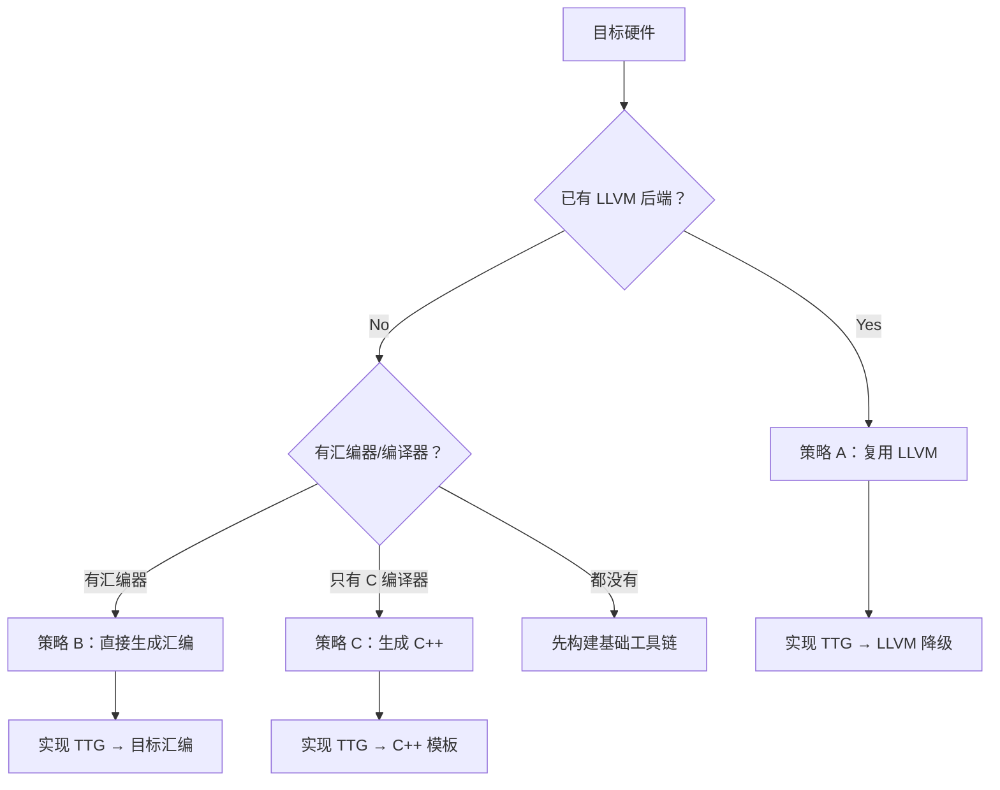

# 第 21 章：设计第三方后端

> **本章目标**：学习如何为第三方硬件设计 Triton 后端，包括设计文档模板、决策树和架构选择。

> 驯龙手记：你即将出发寻找一条新的龙（新硬件）。出发前要先画好"驯龙蓝图"——
> 这条龙有什么特性（指令集）？它的栖息地是怎样的（内存层级）？
> 它与其他龙有什么不同（warp 大小、矩阵乘单元）？蓝图画好了，驯龙就成功了一半。

---

## 配套示例

本章可运行代码位于 `books/examples/chapter21/`：

| 文件 | 章节 | 说明 |
|------|------|------|
| `design_doc_template.md` | 21.2 | 设计文档模板 |
| `scaffold/` | 21.x | 目录脚手架 |

运行：

```bash
cd books/examples/chapter21
./run_examples.sh
```

一键验证全书示例：

```bash
cd books/examples && ./run_all.sh
```

---
## 21.1 设计决策树



## 21.2 设计文档模板

以下是一个完整的后端设计文档框架：

```markdown
# MyGPU Triton 后端设计文档

## 1. 硬件概况
- 目标架构：MyGPU v2
- 核心数：128
- 内存层次：L1（64KB/core）, L2（8MB）, Global（16GB）
- 线程模型：16 threads/warp, 8 warps/CTA
- 特殊指令：矩阵乘单元（16x16x16）、原子操作
- LLVM 后端状态：已存在/不存在

## 2. IR 层级设计
- 是否定义自定义 Dialect？需要哪些 Op？
- 需要哪些优化 Pass？
- 最终降级到哪个 Dialect？

## 3. 内存模型
- 全局内存：如何声明和访问？
- 共享内存：有片上内存吗？大小？地址空间？
- 常量内存/纹理内存？

## 4. 并行模型
- grid/block/thread 如何映射到硬件？
- warp 大小？CTA 大小？
- 同步原语：屏障、原子操作？

## 5. 编译流水线
- 需要哪些阶段？
- 每个阶段做什么？
- 哪个阶段最难实现？

## 6. 运行时需求
- 如何加载内核二进制？
- 如何分配 GPU 内存？
- 如何启动内核？

## 7. 测试计划
- 单元测试（MLIR Pass）
- 集成测试（端到端内核执行）
- 性能基准测试
```

## 21.3 最小可行的编译流水线

对于策略 A（通过 LLVM），最小流水线：

```
ttir → (复用 Triton 已有 Pass) → ttgir → my_dialect → llvm → 目标代码
    ↑                         ↑
  完全复用              需要实现 TTG → 自定义 Dialect 降级
```

```
# 注册阶段（在 add_stages 中）
stages = {
    "ttir":   make_ttir,          # 复用
    "ttgir":  make_ttgir,         # 复用（可能需要调整布局参数）
    "myir":   make_myir,          # 自定义：TTG → My Dialect
    "llir":   make_llir,          # 复用：My Dialect → LLVM
    "bin":    make_binary,        # 自定义：LLVM → 目标代码
}
```

### 各阶段的工作量估算

| 阶段 | 工作量 | 复用度 | 说明 |
|------|--------|--------|------|
| `make_ttir` | 低 | 100% | 设备无关，无需修改 |
| `make_ttgir` | 中 | 80% | 可能需调整编码参数 |
| `make_myir` | 高 | 0% | 核心工作量 |
| `make_llir` | 中 | 50% | 部分复用 LLVM 基础设施 |
| `make_binary` | 中 | 0%-80% | 取决于 LLVM 后端状态 |

## 21.4 自定义 Dialect 设计

需要自定义 Dialect 的场景：

```tablegen
// MyGPUDialect.td
// 封装硬件特有操作

def MyGPU_Dialect : Dialect {
    let name = "mygpu";
    let cppNamespace = "::mlir::mygpu";
}

// 硬件矩阵乘法指令
def MyGPU_MatrixMulOp : MyGPU_Op<"matmul", [Pure]> {
    let arguments = (ins
        F32Tensor16x16:$a,
        F32Tensor16x16:$b,
        F32Tensor16x16:$c
    );
    let results = (outs F32Tensor16x16:$d);
}

// 硬件同步指令
def MyGPU_BarrierOp : MyGPU_Op<"barrier"> {
    let arguments = (ins I32Attr:$barrier_id);
}
```

## 21.5 适配 Coalesce 和编码

如果目标 GPU 的线程组织结构与 NVIDIA 不同（如不同的 warp 大小），需要定制编码：

```python
class MyBackend(BaseBackend):
    def parse_options(self, opts):
        # 设置硬件特有参数
        return MyGPUOptions(
            num_warps=8,           # 默认 8 warps
            warp_size=16,          # 每个 warp 16 线程
            num_stages=2,
        )
    
    def get_codegen_implementation(self, options):
        # 提供 codegen 回调
        return {
            "min_dot_size": lambda lhs, rhs: (1, 1, 16),
            # 硬件矩阵乘最小尺寸
        }
```

## 21.6 C 运行时层

如果目标硬件没有 Python 驱动，需要实现一个 C 运行时：

```c
// driver.c 模板
#include "mygpu_runtime.h"

// 设备管理
MyGPUDevice* get_current_device() { ... }
MyGPUTarget get_current_target() { ... }

// 内核加载与启动
MyGPUModule* load_module(const void* binary, size_t size) { ... }
void launch_kernel(MyGPUModule* mod, const char* name,
                   void** args, int gridX, int gridY, int gridZ) { ... }

// 内存管理
void* allocate_memory(size_t size) { ... }
void free_memory(void* ptr) { ... }
void memcpy_h2d(void* dst, const void* src, size_t size) { ... }
void memcpy_d2h(void* dst, const void* src, size_t size) { ... }
```

## 21.7 性能预期

根据后端策略不同，预期性能：

```
策略 A（通过 LLVM）: 达到手写优化的 70-90%
策略 B（直接汇编）: 达到手写优化的 60-80%
策略 C（C++ 模板）: 达到手写优化的 30-50%
```

---

## 📝 课后作业

### 作业 1：完成设计文档

以你选择的硬件为目标（如国产 GPU），按照 21.2 节的模板完成完整的设计文档。

### 作业 2：决策分析

假设你需要在"已有 LLVM 后端但 optimize 不完善"的 GPU 上实现 Triton，你觉得哪种策略最好？为什么？

### 作业 3：代码框架

按照 21.3 节的目录结构模板，创建 `third_party/my_backend/` 目录和文件框架（空文件即可），确保 CMake 配置正确。

---

## 本章小结

- 设计后端前，先回答：目标硬件有 LLVM 后端吗？有汇编器吗？
- 三种策略：通过 LLVM（推荐）、直接汇编、C++ 模板
- 最小流水线：复用 `make_ttir` → 复用 `make_ttgir` → 自定义降级 → LLVM → 目标代码
- 设计文档应包括：硬件概况、IR 层级、内存模型、并行模型、编译流水线、运行时、测试计划
- 大部分工作量在 TTG → 目标 IR 的降级阶段
